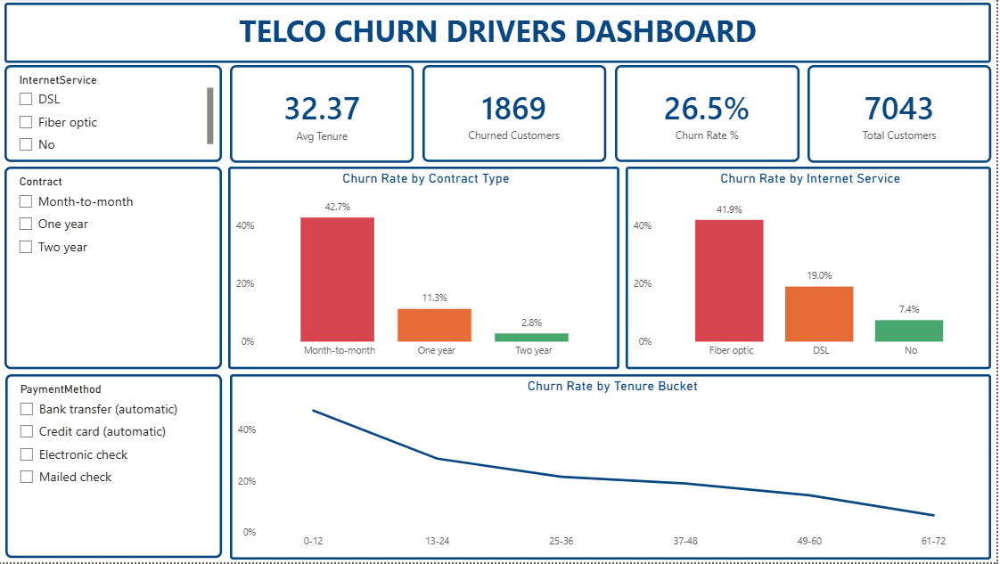

# Telco Customer Churn Analysis

## Project Overview
This project analyzes a dataset of 7,043 telecom customers to uncover why customers churn and which factors drive that decision. The goal is to move from a reactive view of churn to a proactive one — identifying at-risk customer segments so a business can act before losing them. The full pipeline was built end-to-end: cleaned and analyzed in SQL Server (SSMS), then visualized in an interactive Power BI dashboard.

## Business Problem
- Why are customers leaving the company?
- Which factors — contract type, tenure, internet service, payment method — contribute most to churn?
- Which customer segments are highest-risk, and what interventions could reduce churn?

## Dataset Summary
- **Rows:** 7,043 customers
- **Columns:** 21 fields (demographics, account, billing, and service details)
- **Overall churn rate:** 26.5% (1,869 churned / 5,174 retained)
- **Data cleaning:** `TotalCharges` was imported as text and converted to numeric; 11 blank values (all zero-tenure new customers) were set to $0 rather than dropped.

## Tools Used
- **SQL Server Management Studio (SSMS):** data import, cleaning, churn rate calculations by segment, and a summary view (`vw_churn_summary`)
- **Power BI:** DAX measures (Total Customers, Churn Rate %, Churned Customers, Avg Tenure), interactive dashboard with slicers

## Key Findings
| Driver | High-Risk Segment | Low-Risk Segment |
|---|---|---|
| Contract type | Month-to-month — 42.7% | Two-year — 2.8% |
| Tenure | 0–12 months — 47.4% | 61–72 months — 6.6% |
| Internet service | Fiber optic — 41.9% | No internet — 7.4% |
| Payment method | Electronic check — 45.3% | Credit card (auto) — 15.2% |
| Tech Support | Without — 41.6% | With — 15.2% |

## Business Insights
- New customers are the most fragile segment — nearly half churn within their first year.
- Month-to-month contracts trade acquisition ease for 15x higher churn risk than two-year plans.
- Fiber optic customers pay a premium but churn the most — a value gap, not a pricing win.
- Electronic check users show the lowest commitment of any payment method.
- Add-on services like Tech Support and Online Security roughly triple retention when adopted.

## Recommendations
1. Launch a first-year retention program with check-ins at 30/90/180 days.
2. Incentivize month-to-month customers to upgrade to longer contracts.
3. Audit the fiber optic service experience for reliability and pricing gaps.
4. Run a campaign to migrate electronic check users onto autopay.
5. Bundle protective add-ons (Tech Support, Online Security) as opt-out rather than opt-in.

## Dashboard


## Repository Structure
```
Telco-Customer-Churn-Analysis/
├── SQL/
│   └── Telco_churn_data.sql
├── PowerBI/
│   └── telco_churn.pbix
├── Screenshots/
│   └── Telco_churn_customer.png
└── README.md
```
